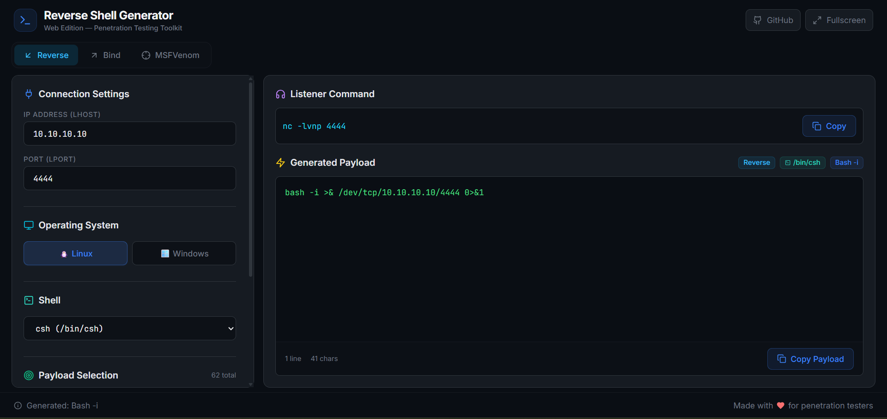

# 🐚 Web Reverse Shell Generator

[](https://reactjs.org/)
[](https://vitejs.dev/)
[](https://tailwindcss.com/)
[](LICENSE)
[](https://Ilias1988.github.io/ReverseShell-Web)

A modern, browser-based shell payload generator built with **React**, **Vite**, and **Tailwind CSS**. Supports **Reverse Shells**, **Bind Shells**, and **MSFVenom** command generation — all from the browser. This is the web port of the [Python Reverse Shell Generator](https://github.com/Ilias1988/RevesrseShell-Generator) desktop application, designed for penetration testers, red teamers, and CTF players.

---



---

## 🌐 Live Demo

👉 **[https://Ilias1988.github.io/ReverseShell-Web](https://Ilias1988.github.io/ReverseShell-Web)**

---

## ✨ Features

| Feature | Description |
|---------|-------------|
| 🎨 **Dark Mode UI** | Sleek, professional dark theme optimized for long hacking sessions |
| 🔀 **3 Mode Tabs** | **Reverse Shell**, **Bind Shell**, and **MSFVenom** generator in one tool |
| 📚 **180+ Payloads** | 90+ reverse, 32 bind, 60+ MSFVenom payload options |
| 🐚 **Shell Selector** | Choose shell binary (sh, bash, zsh, dash, ash, ksh, cmd.exe, powershell.exe, etc.) |
| 💀 **MSFVenom Generator** | Full command builder with payloads, formats, encoders, arch, platform, bad chars |
| 🏷️ **Category Filter** | Filter payloads by language (Bash, Python, PHP, Java, PowerShell, C#, etc.) |
| ⚡ **Real-Time Generation** | Payload and listener update **instantly** as you type IP/Port |
| 🔐 **Smart Encoding** | Supports **Base64**, **URL Encode**, and **Double URL Encode** |
| 🔍 **Searchable Dropdown** | Quickly filter through payloads with live search |
| 📋 **One-Click Copy** | Copy listener or payload to clipboard with animated feedback |
| 📊 **Payload Stats** | Line count and character count displayed in real-time |
| 🏷️ **Info Badges** | Active mode, shell, payload name, and encoding shown as badges |
| 🖥️ **Fullscreen Mode** | Press `F11` for distraction-free fullscreen view |
| 📱 **Responsive** | Works on desktop, tablet, and mobile devices |
| 🔔 **Toast Notifications** | Animated "Copied!" notifications |
| 🚀 **GitHub Pages Ready** | One-command deployment to GitHub Pages |

---

## 🔀 Mode Tabs

### 🔙 Reverse Shell
The attacker **listens** and the target **connects back**. Classic reverse shell payloads for Linux and Windows.

### 🔗 Bind Shell
The target **listens** on a port and the attacker **connects to** the target. Useful when the target can't initiate outbound connections.

### 💀 MSFVenom
Full **MSFVenom command generator** with:
- **60+ payloads** across Linux, Windows, macOS, Web (PHP/Java/Python), and Android
- **Staged & Stageless** payload types
- **30+ output formats** (exe, elf, dll, aspx, war, php, python, powershell, c, csharp, raw, hex, base64, etc.)
- **15+ encoders** (shikata_ga_nai, xor_dynamic, xor, and more)
- **Architecture** selection (x86, x64, ARM, MIPS)
- **Platform** selection
- **Bad characters**, **NOP sled**, **iterations**, **output file**
- **Auto-generated listener/handler** commands (nc or msfconsole)

---

## 🐚 Shell Selector

Dynamically swap the shell binary used in every payload:

| Linux Shells | Windows Shells |
|-------------|---------------|
| `/bin/sh` | `cmd.exe` |
| `/bin/bash` | `powershell.exe` |
| `/bin/zsh` | `pwsh.exe` |
| `/bin/ash` | |
| `/bin/dash` | |
| `/bin/ksh` | |
| `/bin/csh` | |
| `/bin/tcsh` | |
| `/bin/mksh` | |
| `/bin/bsh` | |
| `sh` (no path) | |
| `bash` (no path) | |

> **How it works:** When you select a different shell, all occurrences of `/bin/sh` and `/bin/bash` (or `cmd.exe` on Windows) in the generated payload are automatically replaced with your selection.

---

## 🎯 Supported Payloads

### Reverse Shell — Linux / Generic (60+ payloads)
- **Bash:** `-i`, `196`, `read line`, `5`, `UDP`
- **Netcat:** `mkfifo`, `-e`, `-c`, `BusyBox`
- **Ncat:** TCP and UDP variants
- **Python:** Python 2 & 3 variants, shortest one-liner
- **PHP:** PentestMonkey, Ivan Sincek, `system()`, `exec()`, `shell_exec()`, `popen()`, `proc_open()`, webshells, P0wny Shell
- **Languages:** Perl, Ruby, Java, Node.js, Lua, Golang, Awk, Dart, Crystal, Haskell, Vlang
- **Tools:** Socat (with TTY), OpenSSL, Telnet, zsh, sqlite3, curl, rustcat

### Reverse Shell — Windows (30+ payloads)
- **PowerShell:** Multiple variants including Base64, hidden window, IEX download, TCP
- **Executables:** `nc.exe`, `ncat.exe`
- **Living off the Land:** MSBuild, Mshta, Regsvr32
- **Advanced:** ConPtyShell (fully interactive PTY)
- **Languages:** Python, Ruby, Perl, Lua, Golang, Java, Node.js, Groovy, Haskell

### Bind Shell — Linux (18 payloads)
- **Netcat:** nc, BusyBox nc, ncat (with `--allow`)
- **Socat:** TCP + TTY variants
- **Languages:** Python 2/3, Perl, PHP, Ruby, Node.js, Lua, Golang, Awk
- **Compiled:** C bind shell

### Bind Shell — Windows (14 payloads)
- **Executables:** nc.exe, ncat.exe (with `--allow`)
- **PowerShell:** 2 variants including hidden
- **Languages:** Python, Ruby, Perl, PHP, Node.js, Lua, Golang
- **Compiled:** C# bind shell

### MSFVenom (60+ payload options)
- **Linux:** x86/x64 shell & meterpreter (staged + stageless)
- **Windows:** x86/x64 shell & meterpreter (staged + stageless, HTTP/HTTPS)
- **macOS:** x64 shell & meterpreter
- **Web:** PHP, Java (JSP), Python meterpreter
- **Android:** Meterpreter (TCP, HTTP, HTTPS)

---

## 📦 Installation & Setup

### Prerequisites
- [Node.js](https://nodejs.org/) 18+
- npm (comes with Node.js)

### Quick Start

```bash
# Clone the repository
git clone https://github.com/Ilias1988/ReverseShell-Web.git

# Navigate to the project directory
cd web-revshell

# Install dependencies
npm install

# Start development server
npm run dev
```

The app will open at [http://localhost:3000](http://localhost:3000).

### Build for Production

```bash
npm run build
```

The optimized build will be in the `dist/` directory.

---

## 🚀 Deploy to GitHub Pages

```bash
# Build and deploy in one command
npm run deploy
```

This will build the project and push the `dist/` folder to the `gh-pages` branch.

---

## 🖼️ How to Use

### Reverse / Bind Shell
1. **Select a mode** — Click **Reverse**, **Bind**, or **MSFVenom** tab
2. **Enter your IP address** (LHOST/RHOST) in the IP field
3. **Enter your listening port** (LPORT) in the Port field
4. **Select the target OS** — Linux or Windows
5. **Choose a shell** — Pick from sh, bash, zsh, dash, cmd.exe, powershell.exe, etc.
6. **Filter by category** (optional) — Click a language tag (Bash, Python, PHP, etc.)
7. **Choose a payload** from the searchable dropdown (type to filter!)
8. **Select encoding** (optional): None, Base64, URL, or Double URL
9. **Copy the Listener/Connect command** — click Copy
10. **Copy the Payload** — click Copy Payload

### MSFVenom Generator
1. Switch to the **MSFVenom** tab
2. Select **Platform** (Linux, Windows, macOS, Web, Android)
3. Select **Type** (Staged or Stageless)
4. Choose a **Payload** from the dropdown
5. Select **Output Format** (exe, elf, raw, python, c, csharp, etc.)
6. Configure **Encoder**, **Iterations**, **Bad Characters**, **NOP sled**
7. Set **Architecture** and **Platform** (or leave auto-detect)
8. Optionally set an **Output File** name
9. Copy the generated **msfvenom command** and **listener/handler**

> 💡 **Tip:** All fields update in real-time. Change the IP/Port and watch the output update instantly!

---

## ⌨️ Keyboard Shortcuts

| Key | Action |
|-----|--------|
| `F11` | Toggle Fullscreen Mode |
| `Escape` | Exit Fullscreen Mode |

---

## 📁 Project Structure

```
web-revshell/
├── index.html                          # HTML entry point
├── package.json                        # Dependencies & scripts
├── vite.config.js                      # Vite configuration
├── tailwind.config.js                  # Tailwind CSS configuration
├── postcss.config.js                   # PostCSS configuration
├── public/
│   └── favicon.svg                     # App favicon
├── src/
│   ├── main.jsx                        # React entry point
│   ├── App.jsx                         # Main app layout + mode tabs
│   ├── index.css                       # Tailwind imports + custom styles
│   ├── data/
│   │   ├── payloadsLinux.js            # 60+ Linux reverse shell payloads
│   │   ├── payloadsWindows.js          # 30+ Windows reverse shell payloads
│   │   ├── payloadsBindLinux.js        # 18 Linux bind shell payloads
│   │   ├── payloadsBindWindows.js      # 14 Windows bind shell payloads
│   │   ├── shells.js                   # Shell binary options (sh, bash, zsh, etc.)
│   │   └── msfvenomData.js            # MSFVenom payloads, formats, encoders, generator
│   ├── utils/
│   │   └── encoding.js                 # Base64, URL, Double URL encoding
│   ├── hooks/
│   │   └── useRevShell.js              # Core logic (state, generation, encoding, shell, categories)
│   └── components/
│       ├── layout/
│       │   ├── Header.jsx              # App header with GitHub link
│       │   └── Footer.jsx              # Status bar + credits
│       ├── panels/
│       │   ├── SettingsPanel.jsx        # Left panel (IP, Port, OS, Shell, Category, Payload, Encoding)
│       │   ├── OutputPanel.jsx          # Right panel (Listener + Payload output + badges)
│       │   └── MsfvenomPanel.jsx       # MSFVenom generator (settings + output)
│       └── ui/
│           ├── CopyButton.jsx           # Animated copy-to-clipboard button
│           └── Toast.jsx                # Success notification toast
└── README.md
```

---

## 🛠️ Adding Custom Payloads

You can easily extend the tool by adding your own payloads:

### Reverse Shell Payloads
Edit `src/data/payloadsLinux.js` or `src/data/payloadsWindows.js`:
```javascript
const LINUX_PAYLOADS = {
  // ... existing payloads ...
  "My Custom Shell": `my_command {ip} {port}`,
};
```

### Bind Shell Payloads
Edit `src/data/payloadsBindLinux.js` or `src/data/payloadsBindWindows.js`:
```javascript
const BIND_LINUX_PAYLOADS = {
  // ... existing payloads ...
  "My Bind Shell": `my_command -l {port}`,
};
```

> **Note:** Use `{ip}` and `{port}` as placeholders — they will be automatically replaced with user input. Shell binaries (`/bin/sh`, `cmd.exe`) will be dynamically replaced based on the Shell Selector.

---

## 🔧 Tech Stack

| Technology | Purpose |
|-----------|---------|
| [React 18](https://reactjs.org/) | UI framework |
| [Vite 5](https://vitejs.dev/) | Build tool & dev server |
| [Tailwind CSS 3](https://tailwindcss.com/) | Utility-first CSS framework |
| [Lucide React](https://lucide.dev/) | Beautiful SVG icons |
| [gh-pages](https://github.com/tschaub/gh-pages) | GitHub Pages deployment |

---

## 🔄 Comparison: Python vs Web Version

| Feature | Python (Desktop) | Web (Browser) |
|---------|:-:|:-:|
| Reverse Shell Payloads | 90+ | 90+ |
| **Bind Shell Payloads** | ❌ | ✅ **32** |
| **MSFVenom Generator** | ❌ | ✅ **60+ payloads** |
| **Shell Selector** | ❌ | ✅ **15 shells** |
| **Category Filter** | ❌ | ✅ |
| **Mode Tabs** (Reverse/Bind/MSFVenom) | ❌ | ✅ |
| Real-time generation | ✅ | ✅ |
| Encoding (Base64, URL, Double URL) | ✅ | ✅ |
| Copy to clipboard | ✅ | ✅ |
| Fullscreen mode | ✅ | ✅ |
| Search/Filter payloads | ❌ | ✅ |
| Responsive design | ❌ | ✅ |
| Toast notifications | ❌ | ✅ |
| Payload stats (lines/chars) | ❌ | ✅ |
| Info badges | ❌ | ✅ |
| No installation required | ❌ | ✅ |
| Works on any device | ❌ | ✅ |

---

## ⚠️ Legal Disclaimer

```
THIS TOOL IS PROVIDED FOR EDUCATIONAL PURPOSES AND AUTHORIZED SECURITY AUDITS ONLY.

By using this software, you agree that:

1. You will only use this tool on systems you own or have explicit written 
   permission to test.

2. You understand that unauthorized access to computer systems is illegal 
   and punishable by law.

3. The author(s) of this tool are NOT responsible for any misuse, damage, 
   or illegal activities conducted with this software.

4. You will comply with all applicable local, state, national, and 
   international laws and regulations.

USE AT YOUR OWN RISK. ALWAYS OBTAIN PROPER AUTHORIZATION BEFORE TESTING.
```

---

## 📄 License

This project is licensed under the **MIT License** - see the [LICENSE](LICENSE) file for details.

---

## 🤝 Contributing

Contributions are welcome! Feel free to:
- 🐛 Report bugs
- 💡 Suggest new features
- 🔧 Add new payloads (reverse, bind, or MSFVenom)
- 📝 Improve documentation

---

## 🙏 Acknowledgments

- Web port of [Python RevShell Generator](https://github.com/Ilias1988/RevesrseShell-Generator)
- Inspired by [revshells.com](https://revshells.com)
- Built with [React](https://reactjs.org/), [Vite](https://vitejs.dev/), and [Tailwind CSS](https://tailwindcss.com/)
- Icons by [Lucide](https://lucide.dev/)
- Payload references from the infosec community

---

<p align="center">
  <b>Made with ❤️ for penetration testers</b>
</p>
