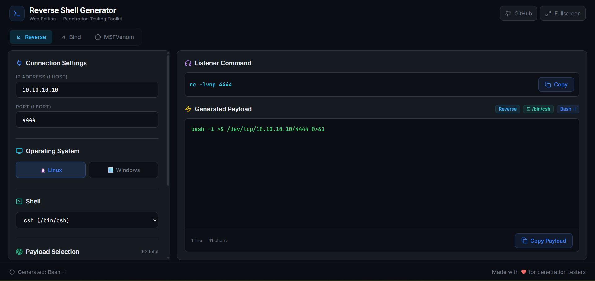

# 🐚 Web Reverse Shell Generator

[](https://reactjs.org/)
[](https://vitejs.dev/)
[](https://tailwindcss.com/)
[](LICENSE)
[](https://ilias1988.github.io/web-revshell)

A modern, browser-based reverse shell payload generator built with **React**, **Vite**, and **Tailwind CSS**. This is the web port of the [Python Reverse Shell Generator](https://github.com/Ilias1988/RevesrseShell-Generator) desktop application, designed for penetration testers, red teamers, and CTF players who need quick access to a comprehensive library of reverse shell commands — directly from the browser.

---



---

## 🌐 Live Demo

👉 **[https://ilias1988.github.io/ReverseShell-Web](https://ilias1988.github.io/ReverseShell-Web)**

---

## ✨ Features

| Feature | Description |
|---------|-------------|
| 🎨 **Dark Mode UI** | Sleek, professional dark theme optimized for long hacking sessions |
| 📚 **90+ Payloads** | **60+ Linux** and **30+ Windows** reverse shell payloads |
| ⚡ **Real-Time Generation** | Payload and listener update **instantly** as you type IP/Port |
| 🔐 **Smart Encoding** | Supports **Base64**, **URL Encode**, and **Double URL Encode** |
| 🔍 **Searchable Dropdown** | Quickly filter through 90+ payloads with live search |
| 📋 **One-Click Copy** | Copy listener or payload to clipboard with animated feedback |
| 📊 **Payload Stats** | Line count and character count displayed in real-time |
| 🏷️ **Info Badges** | Active payload name and encoding shown as badges |
| 🖥️ **Fullscreen Mode** | Press `F11` for distraction-free fullscreen view |
| 📱 **Responsive** | Works on desktop, tablet, and mobile devices |
| 🔔 **Toast Notifications** | Animated "Copied!" notifications |
| 🚀 **GitHub Pages Ready** | One-command deployment to GitHub Pages |

---

## 🎯 Supported Payloads

### Linux / Generic (60+ payloads)
- **Bash:** `-i`, `196`, `read line`, `5`, `UDP`
- **Netcat:** `mkfifo`, `-e`, `-c`, `BusyBox`
- **Ncat:** TCP and UDP variants
- **Python:** Python 2 & 3 variants, shortest one-liner
- **PHP:** PentestMonkey, Ivan Sincek, `system()`, `exec()`, `shell_exec()`, `popen()`, `proc_open()`, webshells, P0wny Shell
- **Languages:** Perl, Ruby, Java, Node.js, Lua, Golang, Awk, Dart, Crystal, Haskell, Vlang
- **Tools:** Socat (with TTY), OpenSSL, Telnet, zsh, sqlite3, curl, rustcat

### Windows (30+ payloads)
- **PowerShell:** Multiple variants including Base64, hidden window, IEX download, TCP
- **Executables:** `nc.exe`, `ncat.exe`
- **Living off the Land:** MSBuild, Mshta, Regsvr32
- **Advanced:** ConPtyShell (fully interactive PTY)
- **Languages:** Python, Ruby, Perl, Lua, Golang, Java, Node.js, Groovy, Haskell

---

## 📦 Installation & Setup

### Prerequisites
- [Node.js](https://nodejs.org/) 18+ 
- npm (comes with Node.js)

### Quick Start

```bash
# Clone the repository
git clone https://github.com/Ilias1988/ReverseShell-Web.git

# Navigate to the project directory
cd web-revshell

# Install dependencies
npm install

# Start development server
npm run dev
```

The app will open at [http://localhost:3000](http://localhost:3000).

### Build for Production

```bash
npm run build
```

The optimized build will be in the `dist/` directory.

---

## 🚀 Deploy to GitHub Pages

```bash
# Build and deploy in one command
npm run deploy
```

This will build the project and push the `dist/` folder to the `gh-pages` branch.

---

## 🖼️ How to Use

1. **Enter your IP address** (LHOST) in the IP field
2. **Enter your listening port** (LPORT) in the Port field
3. **Select the target OS** — Linux or Windows (with payload count badge)
4. **Choose a payload** from the searchable dropdown (type to filter!)
5. **Select encoding** (optional): None, Base64, URL, or Double URL
6. **Copy the Listener command** — click the Copy button next to it
7. **Copy the Payload** — click Copy Payload at the bottom

> 💡 **Tip:** All fields update in real-time. Change the IP/Port and watch the output update instantly!

---

## ⌨️ Keyboard Shortcuts

| Key | Action |
|-----|--------|
| `F11` | Toggle Fullscreen Mode |
| `Escape` | Exit Fullscreen Mode |

---

## 📁 Project Structure

```
web-revshell/
├── index.html                          # HTML entry point
├── package.json                        # Dependencies & scripts
├── vite.config.js                      # Vite configuration
├── tailwind.config.js                  # Tailwind CSS configuration
├── postcss.config.js                   # PostCSS configuration
├── public/
│   └── favicon.svg                     # App favicon
├── src/
│   ├── main.jsx                        # React entry point
│   ├── App.jsx                         # Main app layout
│   ├── index.css                       # Tailwind imports + custom styles
│   ├── data/
│   │   ├── payloadsLinux.js            # 60+ Linux payload templates
│   │   └── payloadsWindows.js          # 30+ Windows payload templates
│   ├── utils/
│   │   └── encoding.js                 # Base64, URL, Double URL encoding
│   ├── hooks/
│   │   └── useRevShell.js              # Core logic (state, generation, encoding)
│   └── components/
│       ├── layout/
│       │   ├── Header.jsx              # App header with GitHub link
│       │   └── Footer.jsx              # Status bar + credits
│       ├── panels/
│       │   ├── SettingsPanel.jsx        # Left panel (IP, Port, OS, Payload, Encoding)
│       │   └── OutputPanel.jsx          # Right panel (Listener + Payload output)
│       └── ui/
│           ├── CopyButton.jsx           # Animated copy-to-clipboard button
│           └── Toast.jsx                # Success notification toast
└── README.md
```

---

## 🛠️ Adding Custom Payloads

You can easily extend the tool by adding your own payloads:

### Example: Adding a Linux payload
Edit `src/data/payloadsLinux.js`:
```javascript
const LINUX_PAYLOADS = {
  // ... existing payloads ...
  "My Custom Shell": `my_command {ip} {port}`,
};
```

### Example: Adding a Windows payload
Edit `src/data/payloadsWindows.js`:
```javascript
const WINDOWS_PAYLOADS = {
  // ... existing payloads ...
  "My Custom Shell": `my_command.exe {ip} {port}`,
};
```

> **Note:** Use `{ip}` and `{port}` as placeholders — they will be automatically replaced with user input.

---

## 🔧 Tech Stack

| Technology | Purpose |
|-----------|---------|
| [React 18](https://reactjs.org/) | UI framework |
| [Vite 5](https://vitejs.dev/) | Build tool & dev server |
| [Tailwind CSS 3](https://tailwindcss.com/) | Utility-first CSS framework |
| [Lucide React](https://lucide.dev/) | Beautiful SVG icons |
| [gh-pages](https://github.com/tschaub/gh-pages) | GitHub Pages deployment |

---

## 🔄 Comparison: Python vs Web Version

| Feature | Python (Desktop) | Web (Browser) |
|---------|:-:|:-:|
| Payloads | 90+ | 90+ |
| Real-time generation | ✅ | ✅ |
| Encoding (Base64, URL, Double URL) | ✅ | ✅ |
| Copy to clipboard | ✅ | ✅ |
| Fullscreen mode | ✅ | ✅ |
| **Search/Filter payloads** | ❌ | ✅ |
| **Responsive design** | ❌ | ✅ |
| **Toast notifications** | ❌ | ✅ |
| **Payload stats (lines/chars)** | ❌ | ✅ |
| **Info badges** | ❌ | ✅ |
| **No installation required** | ❌ | ✅ |
| **Works on any device** | ❌ | ✅ |

---

## ⚠️ Legal Disclaimer

```
THIS TOOL IS PROVIDED FOR EDUCATIONAL PURPOSES AND AUTHORIZED SECURITY AUDITS ONLY.

By using this software, you agree that:

1. You will only use this tool on systems you own or have explicit written 
   permission to test.

2. You understand that unauthorized access to computer systems is illegal 
   and punishable by law.

3. The author(s) of this tool are NOT responsible for any misuse, damage, 
   or illegal activities conducted with this software.

4. You will comply with all applicable local, state, national, and 
   international laws and regulations.

USE AT YOUR OWN RISK. ALWAYS OBTAIN PROPER AUTHORIZATION BEFORE TESTING.
```

---

## 📄 License

This project is licensed under the **MIT License** - see the [LICENSE](LICENSE) file for details.

---

## 🤝 Contributing

Contributions are welcome! Feel free to:
- 🐛 Report bugs
- 💡 Suggest new features
- 🔧 Add new payloads
- 📝 Improve documentation

---

## 🙏 Acknowledgments

- Web port of [Python RevShell Generator](https://github.com/Ilias1988/RevesrseShell-Generator)
- Inspired by [revshells.com](https://revshells.com)
- Built with [React](https://reactjs.org/), [Vite](https://vitejs.dev/), and [Tailwind CSS](https://tailwindcss.com/)
- Icons by [Lucide](https://lucide.dev/)
- Payload references from the infosec community

---

<p align="center">
  <b>Made with ❤️ for penetration testers</b>
</p>
