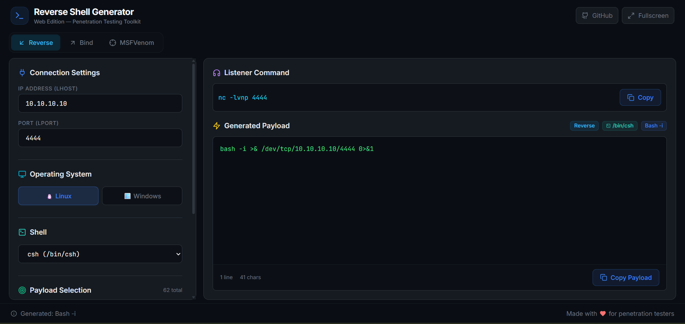

# 🐚 Web Reverse Shell Generator

[](https://reactjs.org/)
[](https://vite.dev/)
[](https://tailwindcss.com/)
[](LICENSE)
[](https://Ilias1988.github.io/ReverseShell-Web)

A modern, browser-based shell payload generator built with **React**, **Vite**, and **Tailwind CSS**. Supports **Reverse Shells**, **Bind Shells**, and **MSFVenom** command generation — all from the browser. This is the web port of the [Python Reverse Shell Generator](https://github.com/Ilias1988/RevesrseShell-Generator) desktop application, designed for penetration testers, red teamers, and CTF players.

---



---

## 🌐 Live Demo

👉 **[https://Ilias1988.github.io/ReverseShell-Web](https://Ilias1988.github.io/ReverseShell-Web)**

---

## ✨ Features

| Feature | Description |
|---------|-------------|
| 🎨 **Dark Mode UI** | Sleek, professional dark theme optimized for long hacking sessions |
| 🔀 **3 Mode Tabs** | **Reverse Shell**, **Bind Shell**, and **MSFVenom** generator in one tool |
| 📚 **170+ Options** | 111 audited reverse/bind payloads plus 60+ MSFVenom payload options |
| 🐚 **Shell Selector** | Choose shell binary (sh, bash, zsh, dash, ash, ksh, cmd.exe, powershell.exe, etc.) |
| 💀 **MSFVenom Generator** | Full command builder with payloads, formats, encoders, arch, platform, bad chars |
| ✨ **Smart Payload Advisor** | Rank payloads by transport, family, and binaries known to exist on the target |
| 📖 **Payload Explanation** | Explain direction, requirements, placeholders, compatibility notes, and the guided workflow |
| 🧪 **Catalog Confidence** | Every selectable payload is marked `conditional` or `experimental`; the UI never claims runtime verification without evidence |
| 🏷️ **Category Filter** | Filter payloads by language (Bash, Python, PHP, Java, PowerShell, C#, etc.) |
| ⚡ **Real-Time Generation** | Payload and listener update **instantly** as you type IP/Port |
| 🔐 **Smart Encoding** | Supports **Base64**, **URL Encode**, and **Double URL Encode** |
| 🔍 **Searchable Dropdown** | Quickly filter through payloads with live search |
| 📋 **One-Click Copy** | Copy listener or payload to clipboard with animated feedback |
| 📊 **Payload Stats** | Line count and character count displayed in real-time |
| 🏷️ **Info Badges** | Active mode, shell, payload name, and encoding shown as badges |
| 🖥️ **Fullscreen Mode** | Press `F11` for distraction-free fullscreen view |
| 📱 **Responsive** | Works on desktop, tablet, and mobile devices |
| 🔔 **Toast Notifications** | Animated "Copied!" notifications |
| 🛡️ **Input Validation** | Validates hosts, ports, MSFVenom options, bad characters, and output filenames |
| ✅ **Automated Verification** | Lint, unit tests, production build, prerender, and desktop/mobile browser checks |
| 🚀 **GitHub Pages Ready** | One-command deployment to GitHub Pages |

---

## ✅ Recent Reliability, Security & UX Improvements

The latest maintenance pass focused on making the application reliable in production, safer when building commands, and easier to use across devices.

| Area | Changes |
|------|---------|
| **Production rendering** | Fixed the prerender/React mounting conflict that could leave tabs, buttons, and inputs unresponsive after a production build |
| **Mobile layout** | Fixed collapsed settings/output panels and restored normal page scrolling; the generated-payload panel now keeps a usable minimum height |
| **PowerShell payloads** | Fixed `{ip}` and `{port}` substitution inside UTF-16LE PowerShell `-EncodedCommand` payloads before re-encoding |
| **MSFVenom generator** | Added editable LHOST/RHOST and LPORT controls, automatic valid payload selection, format/platform/architecture/encoder compatibility checks, and safer argument quoting |
| **Payload catalog** | Removed invalid webshell-style generator entries from selectable command payloads and corrected duplicate/incorrect MSFVenom entries |
| **Catalog hardening** | Added a catalog-wide audit for unresolved placeholders, duplicate templates, legacy doubled braces, metadata validity, and Advisor capability coverage |
| **Generated source** | Fixed legacy doubled-brace output that could make generated C, C#, Go, and PowerShell source invalid |
| **MSFVenom handlers** | Staged command shells and all Meterpreter payloads now generate `exploit/multi/handler`; Netcat is reserved for simple stageless command shells |
| **Advisor accuracy** | Capabilities are derived from the real payload requirements, unavailable entries are hidden by default, and experimental entries require an explicit filter |
| **Catalog scope** | Removed duplicate or delivery-only entries that depended on an unspecified hosted file; retained advanced entries with visible requirements and warnings |
| **Shell selection** | Shell overrides are applied only to compatible templates; fixed payloads now display their actual required interpreter instead of a misleading disabled selection |
| **Validation & safety** | Added host, port, integer-range, bad-character, and output-filename validation; invalid values no longer produce commands |
| **Accessibility** | Added labels, ARIA tab/listbox semantics, pressed/expanded states, keyboard handling, and clearer validation feedback |
| **React lifecycle** | Cleaned up timers and event listeners and removed state-sync effects that could cause stale selections or unnecessary renders |
| **Prerender hardening** | Bound the temporary server to `127.0.0.1`, added path confinement and malformed-URL handling, randomized its port, and guaranteed browser/server cleanup |
| **Browser compatibility** | Build scripts can use Puppeteer's browser or automatically fall back to an installed Chrome, Edge, or Chromium executable |
| **Toolchain security** | Upgraded Vite, Puppeteer, PostCSS, Tailwind CSS, and related build dependencies; `npm audit` reports **0 known vulnerabilities** |

### Verification result

The repaired production build has been checked with:

- ESLint with zero errors or warnings
- 24/24 passing unit tests
- Passing audit of all 111 selectable reverse/bind payloads
- Successful Vite production build and static prerender
- Successful desktop interaction test for MSFVenom LHOST updates
- Successful mobile layout/scrolling test at a 390 × 844 viewport
- No browser runtime errors during the final end-to-end run

### Catalog confidence levels

- **Verified** — reserved for a payload executed successfully in a recorded test environment. The current release intentionally contains no payload with this label yet.
- **Conditional** — the template, placeholders, and requirements passed static review, but behavior still depends on the target OS, binary implementation, version, firewall, and network path.
- **Experimental** — uncommon, compiled, external-resource, or LOLBAS-style payload. Hidden by default in the Advisor and intended for deliberate lab validation.
- **Deprecated** — retained only for compatibility and not recommended. There are currently no selectable deprecated entries.

The generator creates commands; it does not execute them. Always verify the generated output and listener in an isolated, authorized target before relying on it during an assessment.

---

## 🔀 Mode Tabs

### 🔙 Reverse Shell
The attacker **listens** and the target **connects back**. Classic reverse shell payloads for Linux and Windows.

### 🔗 Bind Shell
The target **listens** on a port and the attacker **connects to** the target. Useful when the target can't initiate outbound connections.

### 💀 MSFVenom
Full **MSFVenom command generator** with:
- **60+ payloads** across Linux, Windows, macOS, Web (PHP/Java/Python), and Android
- **Staged & Stageless** payload types
- **30+ output formats** (exe, elf, dll, aspx, war, php, python, powershell, c, csharp, raw, hex, base64, etc.)
- **15+ encoders** (shikata_ga_nai, xor_dynamic, xor, and more)
- **Architecture** selection (x86, x64, ARM, MIPS)
- **Platform** selection
- **Bad characters**, **NOP sled**, **iterations**, **output file**
- **Auto-generated listener/handler** commands (nc or msfconsole)

---

## 🐚 Shell Selector

Dynamically swap the shell binary used in every payload:

| Linux Shells | Windows Shells |
|-------------|---------------|
| `/bin/sh` | `cmd.exe` |
| `/bin/bash` | `powershell.exe` |
| `/bin/zsh` | `pwsh.exe` |
| `/bin/ash` | |
| `/bin/dash` | |
| `/bin/ksh` | |
| `/bin/csh` | |
| `/bin/tcsh` | |
| `/bin/mksh` | |
| `/bin/bsh` | |
| `sh` (no path) | |
| `bash` (no path) | |

> **How it works:** When the selected payload supports shell substitution, occurrences of `/bin/sh`, `/bin/bash`, or `cmd.exe` are safely replaced with your selection. The selector is disabled for payloads that require a specific interpreter or cannot be rewritten reliably.

---

## 🎯 Supported Payloads

### Reverse Shell — Linux / Generic (55 payloads)
- **Bash:** `-i`, `196`, `read line`, `5`, `UDP`
- **Netcat:** `mkfifo`, `-e`, `-c`, `BusyBox`
- **Ncat:** TCP and UDP variants
- **Python:** Python 2 & 3 variants, shortest one-liner
- **PHP:** PentestMonkey, Ivan Sincek, `system()`, `shell_exec()`, `popen()`, and `proc_open()` variants
- **Languages:** Perl, Ruby, Java, Node.js, Lua, Golang, Awk, Dart, Crystal, Haskell, Vlang
- **Tools:** Socat (with TTY), OpenSSL, Telnet, zsh, sqlite3, and rustcat

### Reverse Shell — Windows (24 payloads)
- **PowerShell:** Multiple direct and Base64/EncodedCommand variants
- **Executables:** `nc.exe`, `ncat.exe`
- **Living off the Land:** MSBuild (experimental; requires an explicit build workflow)
- **Advanced:** ConPtyShell (experimental; downloads a reviewed external script)
- **Languages:** Python, Ruby, Perl, Lua, Golang, Java, Node.js, Groovy, Haskell

### Bind Shell — Linux (18 payloads)
- **Netcat:** nc, BusyBox nc, ncat (with `--allow`)
- **Socat:** TCP + TTY variants
- **Languages:** Python 2/3, Perl, PHP, Ruby, Node.js, Lua, Golang, Awk
- **Compiled:** C bind shell

### Bind Shell — Windows (14 payloads)
- **Executables:** nc.exe, ncat.exe (with `--allow`)
- **PowerShell:** 2 variants including hidden
- **Languages:** Python, Ruby, Perl, PHP, Node.js, Lua, Golang
- **Compiled:** C# bind shell

### MSFVenom (60+ payload options)
- **Linux:** x86/x64 shell & meterpreter (staged + stageless)
- **Windows:** x86/x64 shell & meterpreter (staged + stageless, HTTP/HTTPS)
- **macOS:** x64 shell & meterpreter
- **Web:** PHP, Java (JSP), Python meterpreter
- **Android:** Meterpreter (TCP, HTTP, HTTPS)

---

## 📦 Installation & Setup

### Prerequisites
- [Node.js](https://nodejs.org/) `^20.19.0` or `>=22.12.0`
- npm (comes with Node.js)

### Quick Start

```bash
# Clone the repository
git clone https://github.com/Ilias1988/ReverseShell-Web.git

# Navigate to the project directory
cd web-revshell

# Install dependencies
npm install

# Start development server
npm run dev
```

The app will open at [http://localhost:3000](http://localhost:3000).

### Build for Production

```bash
npm run build
```

The optimized build will be in the `dist/` directory.

---

## 🧪 Testing & Verification

```bash
# Static analysis
npm run lint

# Core payload-generation and validation tests
npm test

# Full selectable-payload catalog audit
npm run audit:catalog

# Complete check: lint + tests + production build + prerender + browser E2E
npm run verify
```

`npm run verify` uses a headless browser to confirm that the production build remains interactive on desktop and that the generated-payload panel is visible and scrollable on mobile.

---

## 🚀 Deploy to GitHub Pages

```bash
# Build and deploy in one command
npm run deploy
```

This will build the project and push the `dist/` folder to the `gh-pages` branch.

---

## 🖼️ How to Use

### Reverse / Bind Shell
1. **Select a mode** — Click **Reverse**, **Bind**, or **MSFVenom** tab
2. **Enter your IP address** (LHOST/RHOST) in the IP field
3. **Enter your listening port** (LPORT) in the Port field
4. **Select the target OS** — Linux or Windows
5. **Choose a shell** — Pick from sh, bash, zsh, dash, cmd.exe, powershell.exe, etc.
6. **Filter by category** (optional) — Click a language tag (Bash, Python, PHP, etc.)
7. **Choose a payload** from the searchable dropdown (type to filter!)
8. **Select encoding** (optional): None, Base64, URL, or Double URL
9. **Copy the Listener/Connect command** — click Copy
10. **Copy the Payload** — click Copy Payload

### Smart Payload Advisor

1. Choose **Reverse** or **Bind** and the target operating system
2. Click **Smart Payload Advisor** above the payload filters
3. Select TCP/UDP and an optional payload family
4. Mark only binaries or interpreters you know are available on the target
5. Review the `Capability match`, `Check requirements`, and `Unavailable` explanations
6. Click **Use payload** to apply a recommendation without changing the IP, port, encoding, or OS

Leaving all target capabilities unselected keeps every matching payload visible and marks its requirements as unconfirmed.
By default, the Advisor recommends reviewed `conditional` entries and hides `experimental` entries. Use the **Catalog confidence** filter only when you intentionally want to inspect advanced payloads.

### Payload Explanation

1. Select any reverse or bind payload
2. Click **Explain selected payload**
3. Review connection direction, interpreter, required binaries, and placeholders
4. Check compatibility warnings before using the command in an authorized lab
5. Follow the listener/payload workflow and optional Linux TTY-stabilization notes

Explanations are generated entirely from trusted local metadata and never execute or upload a payload.

### MSFVenom Generator
1. Switch to the **MSFVenom** tab
2. Select **Platform** (Linux, Windows, macOS, Web, Android)
3. Select **Type** (Staged or Stageless)
4. Choose a **Payload** from the dropdown
5. Select **Output Format** (exe, elf, raw, python, c, csharp, etc.)
6. Configure **Encoder**, **Iterations**, **Bad Characters**, **NOP sled**
7. Set **Architecture** and **Platform** (or leave auto-detect)
8. Optionally set an **Output File** name
9. Copy the generated **msfvenom command** and **listener/handler**

> 💡 **Tip:** All fields update in real-time. Change the IP/Port and watch the output update instantly!

---

## ⌨️ Keyboard Shortcuts

| Key | Action |
|-----|--------|
| `F11` | Toggle Fullscreen Mode |
| `Escape` | Exit Fullscreen Mode |

---

## 📁 Project Structure

```
web-revshell/
├── eslint.config.js                    # ESLint configuration
├── index.html                          # HTML entry point
├── package.json                        # Dependencies & scripts
├── vite.config.js                      # Vite configuration
├── tailwind.config.js                  # Tailwind CSS configuration
├── postcss.config.js                   # PostCSS configuration
├── scripts/
│   ├── browser.js                      # Installed-browser discovery for Puppeteer
│   ├── prerender.js                    # Hardened static prerender workflow
│   └── verify-build.js                 # Desktop/mobile production browser checks
├── tests/
│   └── core.test.js                    # Payload, metadata, Advisor, validation, and MSFVenom tests
├── public/
│   └── favicon.svg                     # App favicon
├── src/
│   ├── main.jsx                        # React entry point
│   ├── App.jsx                         # Main app layout + mode tabs
│   ├── index.css                       # Tailwind imports + custom styles
│   ├── features/
│   │   ├── payloadAdvisor/
│   │       ├── advisorEngine.js        # Deterministic compatibility scoring and ranking
│   │       ├── payloadMetadata.js      # Validated metadata for all selectable payloads
│   │       └── PayloadAdvisor.jsx      # Accessible guided-selection dialog
│   │   └── payloadExplanation/
│   │       ├── explanationEngine.js    # Structured local payload explanations
│   │       └── PayloadExplanation.jsx  # Accessible explanation and workflow dialog
│   ├── data/
│   │   ├── payloadsLinux.js            # 60+ Linux reverse shell payloads
│   │   ├── payloadsWindows.js          # 30+ Windows reverse shell payloads
│   │   ├── payloadsBindLinux.js        # 18 Linux bind shell payloads
│   │   ├── payloadsBindWindows.js      # 14 Windows bind shell payloads
│   │   ├── shells.js                   # Shell binary options (sh, bash, zsh, etc.)
│   │   └── msfvenomData.js            # MSFVenom payloads, formats, encoders, generator
│   ├── utils/
│   │   ├── encoding.js                 # Encoding and PowerShell placeholder injection
│   │   ├── shells.js                   # Safe shell-override compatibility logic
│   │   └── validation.js               # Host, port, option, and filename validation
│   ├── hooks/
│   │   └── useRevShell.js              # Core logic (state, generation, encoding, shell, categories)
│   └── components/
│       ├── layout/
│       │   ├── Header.jsx              # App header with GitHub link
│       │   └── Footer.jsx              # Status bar + credits
│       ├── panels/
│       │   ├── SettingsPanel.jsx        # Left panel (IP, Port, OS, Shell, Category, Payload, Encoding)
│       │   ├── OutputPanel.jsx          # Right panel (Listener + Payload output + badges)
│       │   └── MsfvenomPanel.jsx       # MSFVenom generator (settings + output)
│       └── ui/
│           ├── CopyButton.jsx           # Animated copy-to-clipboard button
│           └── Toast.jsx                # Success notification toast
└── README.md
```

---

## 🛠️ Adding Custom Payloads

You can easily extend the tool by adding your own payloads:

### Reverse Shell Payloads
Edit `src/data/payloadsLinux.js` or `src/data/payloadsWindows.js`:
```javascript
const LINUX_PAYLOADS = {
  // ... existing payloads ...
  "My Custom Shell": `my_command {ip} {port}`,
};
```

### Bind Shell Payloads
Edit `src/data/payloadsBindLinux.js` or `src/data/payloadsBindWindows.js`:
```javascript
const BIND_LINUX_PAYLOADS = {
  // ... existing payloads ...
  "My Bind Shell": `my_command -l {port}`,
};
```

> **Note:** Use `{ip}` and `{port}` as placeholders — they will be automatically replaced with user input. Shell binaries (`/bin/sh`, `cmd.exe`) will be dynamically replaced based on the Shell Selector.

Every new selectable payload must also pass `npm run audit:catalog`. Add explicit metadata overrides when automatic category, runtime, transport, warning, or confidence inference would be misleading.

## 🔎 Compatibility references

- [GNU Bash redirections](https://www.gnu.org/software/bash/manual/html_node/Redirections.html) for `/dev/tcp` and `/dev/udp` behavior
- [Nmap Ncat command execution](https://nmap.org/ncat/guide/ncat-exec.html) for implementation-specific `--exec`/`-e` behavior
- [Rapid7 payload types](https://docs.rapid7.com/metasploit/working-with-payloads/) for staged/stageless naming and handler requirements
- [Rapid7 Payload Generator](https://docs.rapid7.com/metasploit/the-payload-generator/) for MSFVenom generation guidance

---

## 🔧 Tech Stack

| Technology | Purpose |
|-----------|---------|
| [React 18](https://reactjs.org/) | UI framework |
| [Vite 8](https://vite.dev/) | Build tool & dev server |
| [Tailwind CSS 3](https://tailwindcss.com/) | Utility-first CSS framework |
| [Lucide React](https://lucide.dev/) | Beautiful SVG icons |
| [gh-pages](https://github.com/tschaub/gh-pages) | GitHub Pages deployment |

---

## 🔄 Comparison: Python vs Web Version

| Feature | Python (Desktop) | Web (Browser) |
|---------|:-:|:-:|
| Reverse Shell Payloads | 90+ | 90+ |
| **Bind Shell Payloads** | ❌ | ✅ **32** |
| **MSFVenom Generator** | ❌ | ✅ **60+ payloads** |
| **Shell Selector** | ❌ | ✅ **15 shells** |
| **Category Filter** | ❌ | ✅ |
| **Mode Tabs** (Reverse/Bind/MSFVenom) | ❌ | ✅ |
| Real-time generation | ✅ | ✅ |
| Encoding (Base64, URL, Double URL) | ✅ | ✅ |
| Copy to clipboard | ✅ | ✅ |
| Fullscreen mode | ✅ | ✅ |
| Search/Filter payloads | ❌ | ✅ |
| Responsive design | ❌ | ✅ |
| Toast notifications | ❌ | ✅ |
| Payload stats (lines/chars) | ❌ | ✅ |
| Info badges | ❌ | ✅ |
| No installation required | ❌ | ✅ |
| Works on any device | ❌ | ✅ |

---

## ⚠️ Legal Disclaimer

```
THIS TOOL IS PROVIDED FOR EDUCATIONAL PURPOSES AND AUTHORIZED SECURITY AUDITS ONLY.

By using this software, you agree that:

1. You will only use this tool on systems you own or have explicit written 
   permission to test.

2. You understand that unauthorized access to computer systems is illegal 
   and punishable by law.

3. The author(s) of this tool are NOT responsible for any misuse, damage, 
   or illegal activities conducted with this software.

4. You will comply with all applicable local, state, national, and 
   international laws and regulations.

USE AT YOUR OWN RISK. ALWAYS OBTAIN PROPER AUTHORIZATION BEFORE TESTING.
```

---

## 📄 License

This project is licensed under the **MIT License** - see the [LICENSE](LICENSE) file for details.

---

## 🤝 Contributing

Contributions are welcome! Feel free to:
- 🐛 Report bugs
- 💡 Suggest new features
- 🔧 Add new payloads (reverse, bind, or MSFVenom)
- 📝 Improve documentation

---

## 🙏 Acknowledgments

- Web port of [Python RevShell Generator](https://github.com/Ilias1988/RevesrseShell-Generator)
- Inspired by [revshells.com](https://revshells.com)
- Built with [React](https://reactjs.org/), [Vite](https://vitejs.dev/), and [Tailwind CSS](https://tailwindcss.com/)
- Icons by [Lucide](https://lucide.dev/)
- Payload references from the infosec community

---

<p align="center">
  <b>Made with ❤️ for penetration testers</b>
</p>
